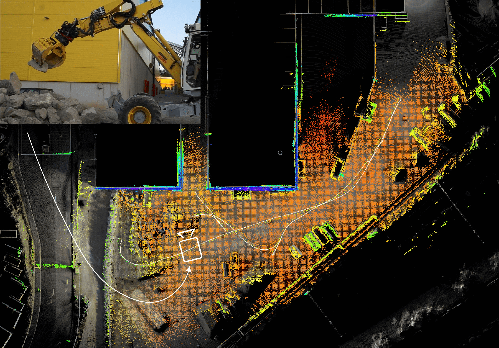

# Graph-based State Multi-sensor Fusion for Consistent Localization
**
Authors:** [Julian Nubert](https://juliannubert.com/) ([nubertj@ethz.ch](mailto:nubertj@ethz.ch?subject=[GitHub]))
, [Shehryar Khattak](https://www.linkedin.com/in/shehryar-khattak/)
, [Marco Hutter](https://rsl.ethz.ch/the-lab/people/person-detail.MTIxOTEx.TGlzdC8yNDQxLC0xNDI1MTk1NzM1.html)

*Copyright IEEE*

Resources: [paper](https://arxiv.org/pdf/2203.01389.pdf), [video](https://youtu.be/syTV7Ui36jg), [project page](https://sites.google.com/leggedrobotics.com/gmfcl).

## Overview
The presented framework aims for flexible and fast fusion of multiple sensor modalities. The state estimate is 
published at **imu frequency** through IMU pre-integration and a multi-threaded implementation and bookkeeping. 
Adding of the measurements and the optimization of the graph is performed in different threads. 
In contrast to classical filtering-based approaches this graph-based structure also allows for a simple incorporation of
delayed sensor measurements.

This repository contains 3 packages:

1. CompslamSE: The core library for the sensor fusion. This library is only dependant on Eigen and GTSAM.
2. CompslamSERos: This can be understood as an example to run sensor fusion using the developed library.

## Dependencies
### CompslamSE
CompslamSE only has two main dependencies: Eigen3 and GTSAM.
#### Eigen3
Just make sure you have the Eigen3-headers.
#### GTSAM
* Version: [GTSAM 4.1.1](https://github.com/borglab/gtsam/tree/4.1.1)
* Clone and Checkout:
```bash
git clone git@github.com:borglab/gtsam.git
cd gtsam
git checkout 4.1.1
mkdir build && cd build
```
* Use CMake with given options:
```bash
cmake -DCMAKE_INSTALL_PREFIX:PATH=$HOME/.local -DCMAKE_BUILD_TYPE=Release -DGTSAM_POSE3_EXPMAP=ON -DGTSAM_ROT3_EXPMAP=ON -DGTSAM_USE_QUATERNIONS=ON -DGTSAM_USE_SYSTEM_EIGEN=ON -DGTSAM_BUILD_WITH_MARCH_NATIVE=OFF ..
``` 
* Compile and install locally: 
```bash
make install -j$(nproc)
```
* Environment variables (e.g. add to your .bashrc-file):
```
export CMAKE_PREFIX_PATH=$HOME/.local/:$CMAKE_PREFIX_PATH
export LD_LIBRARY_PATH=$HOME/.local/lib/:$LD_LIBRARY_PATH
export LIBRARY_PATH=${LIBRARY_PATH}:${LD_LIBRARY_PATH}
```

## Building
### Library
```bash
catkin build compslam_se
```
### CompslamRos
```bash
catkin build compslam_se_ros
```

## Example Usage
In this repository we provide two examples for running the pipeline:

1. IMU + GNSS + LiDAR Odometry, with dual-graph formulation, as presented in this accompanying [paper](https://arxiv.org/pdf/2203.01389.pdf).
2. IMU + LiDAR Odometry on a dataset recorded on ANYmal robot, with only one single main graph.

Both examples can be found in CompslamSeRos in the corresponding launch files.
```bash
roslaunch compslam_se_ros imu_gnss_lidar.launch
roslaunch compslam_se_ros imu_lidar.launch
```
Note that the imu_lidar can also be used to fuse IMU with other 6DoF odometry measurements.

## Custom Usage
For custom usage, such as the fusion of more sensor measurements, an own class with the desired functionality can be implemented.
This class only has to inherit from the **CompslamSeInterface** base-class.

For usage three functionalities have to be implemented by the user:

1. (ROS)-callbacks or other code snippets can be used to add measurements through the given interface as 
specified [here](compslam_se/include/compslam_se/CompslamSeInterface.h). Examples for this can be seen in 
[CompslamSeRos](compslam_se_ros), where ROS subscribers are used to add the measurements to the graph.
2. Furthermore, the purely virtual functions _publishState__ needs to be implemented. This method is called after each 
arrival of an IMU measurement to publish the state in the desired format.
3. Lastly, _readParams__ is called during initialization, and is needed to load extrinsic parameters inside the 
[StaticTransforms](compslam_se/include/compslam_se/StaticTransforms.h) required for coordinate transformations.

## Parameters
Parameters for IMU can be calculated using these [instructions](https://github.com/ethz-asl/kalibr/wiki/IMU-Noise-Model).
### Used: Lord microstrain MV5-AR  IMU in Roofbox
* [Datasheet](https://www.microstrain.com/sites/default/files/mv5-ar_datasheet_8400-0122_rev_d.pdf)
* Values
  * Noise density
    * Accelerometer: 85 ug/sqrt(Hz)=85e-5m/s^2/sqrt(Hz)
    * Gyroscope: 0.0075° /sec/√Hz=1.309e-4 rad/s/sqrt(Hz)

## Paper
If you use any of this code, please consider citing our paper
```
@inproceedings{nubert2022graph,
  title={Graph-based Multi-sensor Fusion for Consistent Localization of Autonomous Construction Robots},
  author={Nubert, Julian and Khattak, Shehryar and Hutter, Marco},
  booktitle={IEEE International Conference on Robotics and Automation (ICRA)},
  year={2022},
  organization={IEEE}
}
```
