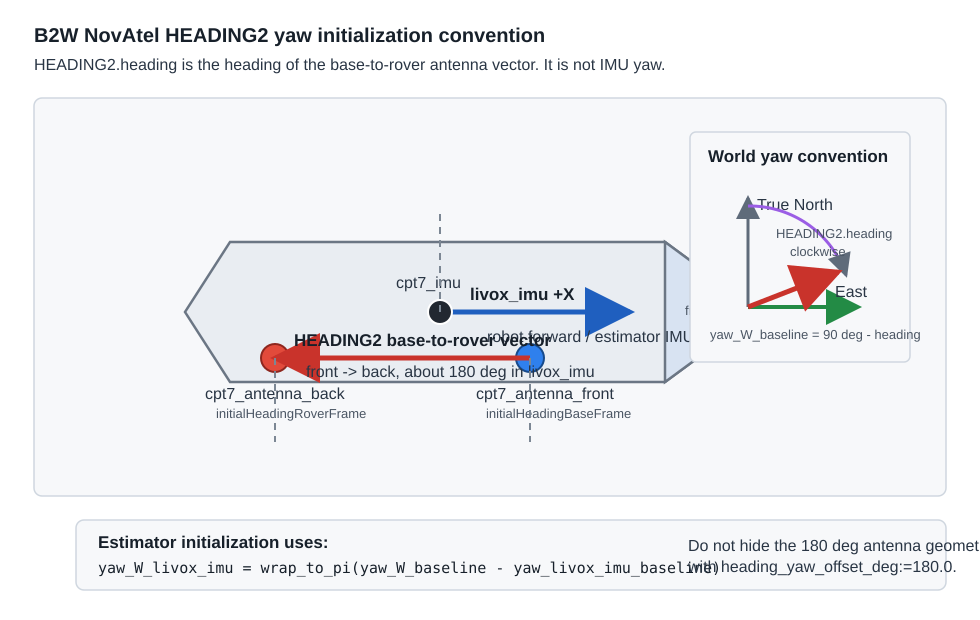

# Correct NovAtel HEADING2 Usage For B2W Yaw Initialization

This note documents the B2W-specific convention for using NovAtel `HEADING2`
as the initial yaw source for the GraphMSF holistic fusion estimator.

The key point is simple:

`HEADING2.heading` is not the yaw of `cpt7_imu`, `livox_imu`, `pps_origin`,
or the vehicle body. It is the heading of the GNSS antenna baseline from the
configured base antenna to the configured rover antenna.

For B2W, GraphMSF estimates the IMU state in the `livox_imu` frame. Therefore
the NovAtel antenna baseline heading must be converted into
`yaw(W<-livox_imu)` before calling GraphMSF yaw and position initialization.

## Source Semantics

NovAtel defines `HEADING2.heading` as the clockwise angle from True North of
the base-to-rover antenna vector. This is an ALIGN moving-baseline quantity,
not a robot body attitude quantity.

The ROS `novatel_oem7_msgs/msg/HEADING2` message exposes the OEM7 fields
directly, including:

- `length`
- `heading`
- `pitch`
- `heading_stdev`
- `pitch_stdev`
- `rover_stn_id`
- `master_stn_id`

The NovAtel ROS driver does not reinterpret the heading as a robot-frame yaw.
Its `MakeROSMessage<novatel_oem7_msgs::HEADING2>` path copies the OEM7 fields
such as heading, pitch, baseline length, standard deviations, and station IDs
into the ROS message. Frame semantics remain the NovAtel HEADING2 semantics.

The local B2W adapter only converts the angle convention and covariance:

- NovAtel heading: clockwise from True North.
- Estimator ENU yaw: counter-clockwise from East.
- `heading_stdev` in degrees becomes yaw variance in radians squared.

This first conversion is:

```text
yaw_W_baseline = wrap_to_pi((90.0 - heading_deg + heading_yaw_offset_deg) * pi / 180.0)
yaw_variance = (heading_stdev_deg * pi / 180.0)^2
```

For the normal B2W launch, `heading_yaw_offset_deg` must stay `0.0`. A numeric
offset is not the fix for antenna ordering or frame geometry.

## B2W Baseline Convention

The current B2W configuration is:

```yaml
gnss_params:
  useYawInitialGuessFromHeading: true
  initialHeadingMaxAgeSec: 2.0
  initialHeadingBaseFrame: "cpt7_antenna_front"
  initialHeadingRoverFrame: "cpt7_antenna_back"
```

That means the HEADING2 baseline used for initialization is:

```text
cpt7_antenna_front -> cpt7_antenna_back
```

In the B2W TF tree this baseline points roughly opposite to the forward Livox
IMU x-axis. In a representative replay, the logged horizontal baseline yaw was
about:

```text
baseline_yaw(livox_imu<-base_to_rover) [deg] = 179.73
```

That 180 deg geometry is real. It comes from the physical antenna ordering. It
must be represented by the configured TF frames, not by hiding it in a one-off
heading offset.

The figure below shows the top-down convention used by the B2W estimator:



The blue vector is the estimator IMU forward direction. The red vector is the
NovAtel HEADING2 base-to-rover vector. On B2W those two vectors point in
opposite directions because the configured baseline is
`cpt7_antenna_front -> cpt7_antenna_back`.

## Full Conversion Used By The Estimator

The estimator receives `/gnss/initial_yaw` from
`novatel_oem7_adapter_node`. That message contains `yaw_W_baseline`, and its
header frame is a descriptive source label:

```text
cpt7_heading2_base_to_rover
```

During GNSS initialization, `B2WEstimator` transforms the antenna baseline yaw
into the GraphMSF IMU yaw using TF:

```text
T_livox_imu_base  = TF(livox_imu <- initialHeadingBaseFrame)
T_livox_imu_rover = TF(livox_imu <- initialHeadingRoverFrame)

baseline_livox_imu = translation(T_livox_imu_rover)
                   - translation(T_livox_imu_base)

baseline_livox_imu.z = 0

yaw_livox_imu_baseline = atan2(baseline_livox_imu.y,
                               baseline_livox_imu.x)

yaw_W_livox_imu = wrap_to_pi(yaw_W_baseline - yaw_livox_imu_baseline)
```

Then the estimator calls GraphMSF yaw and position initialization with the yaw
of `livox_imu` in the world frame. The initial yaw is consumed once. It is not
used as a continuous heading factor or recurring measurement.

## Why Direct HEADING2-As-IMU-Yaw Was Wrong

The original failure mode was caused by treating the HEADING2 heading as if it
were already the yaw of an IMU/body frame. On B2W this is wrong because the
configured NovAtel baseline is approximately:

```text
livox_imu +X direction:        forward
HEADING2 base-to-rover vector: backward, about 180 deg in livox_imu
```

If `yaw_W_baseline` is passed directly as `yaw(W<-livox_imu)`, the estimator
initializes the IMU about 180 deg away from the intended robot yaw. In
`trajectory_xy.png` that presents as a wrong-way startup trajectory: the fusion
line initially moves in the opposite direction before subsequent measurements
pull it back.

Do not fix this with:

```text
heading_yaw_offset_deg:=180.0
```

That is a hack. It makes one mission appear better while leaving the actual
antenna-frame convention undocumented and unenforced. The correct fix is to
configure the real base and rover antenna frames and let TF provide the
baseline direction in the estimator IMU frame.

## Runtime Path

The live B2W NovAtel launch uses:

```text
dependencies/holistic_fusion/ros2/examples/b2w_estimator_graph_ros2/launch/novatel_b2w_estimator_graph_live.launch.py
```

Relevant launch defaults:

```text
heading2_topic:=/gt_box/cpt7/heading2
initial_yaw_topic:=/gnss/initial_yaw
sensor_frame_id:=cpt7_heading2_base_to_rover
heading_yaw_offset_deg:=0.0
use_initial_heading:=true
initial_heading_max_age_sec:=2.0
```

The adapter node:

```text
/gt_box/cpt7/heading2
  -> novatel_oem7_adapter_node
  -> /gnss/initial_yaw
```

The estimator then consumes `/gnss/initial_yaw` during GNSS initialization:

```text
/gnss/initial_yaw
  -> B2WEstimator::getFreshInitialYaw_()
  -> B2WEstimator::transformInitialYawToImu_()
  -> B2WEstimator::transformInitialHeadingBaselineToImu_()
  -> GraphMSF yaw and position initialization
```

## Operational Checks

Before trusting the startup yaw, verify all of these.

1. The HEADING2 topic exists and contains valid messages:

```bash
ros2 topic echo /gt_box/cpt7/heading2 --once
```

The estimator adapter accepts messages only when the HEADING2 solution is
computed, the position type is not `NONE`, heading is finite, and
`heading_stdev` is finite and nonnegative.

2. The baseline frames exist in TF:

```bash
ros2 run tf2_ros tf2_echo livox_imu cpt7_antenna_front
ros2 run tf2_ros tf2_echo livox_imu cpt7_antenna_back
```

Both transforms must be available before initialization can convert the
baseline yaw. If either transform is missing, the estimator waits instead of
silently falling back to trajectory alignment while heading initialization is
enabled.

3. The launch uses the B2W antenna-frame convention:

```bash
ros2 param get /b2w_estimator_node gnss_params.initialHeadingBaseFrame
ros2 param get /b2w_estimator_node gnss_params.initialHeadingRoverFrame
```

Expected values:

```text
cpt7_antenna_front
cpt7_antenna_back
```

4. The startup log prints the three yaw quantities:

```text
GNSS initialization using NovAtel HEADING2 initial yaw.
measured yaw(W<-base_to_rover) [deg]=...
base_frame=cpt7_antenna_front
rover_frame=cpt7_antenna_back
baseline_yaw(livox_imu<-base_to_rover) [deg]=...
transformed yaw(W<-livox_imu) [deg]=...
```

For the verified B2W replay, the expected shape of the numbers was:

```text
measured yaw(W<-base_to_rover) [deg] ~= -58.80
baseline_yaw(livox_imu<-base_to_rover) [deg] ~= 179.73
transformed yaw(W<-livox_imu) [deg] ~= 121.46
```

The exact values can change with mission heading and calibration, but the
relationship must hold:

```text
transformed yaw = measured baseline yaw - baseline yaw in livox_imu
```

5. Replay plots should not show a wrong-way startup curl:

```bash
utils/holistic_fusion_replay/run_replay.sh --rebuild-overlay
```

Check:

```text
~/bags/holistic_fusion_replay/real_outdoor_2/comparison/trajectory_xy.png
~/bags/holistic_fusion_replay/real_outdoor_2/comparison/fusion_rpy_timeseries.png
~/bags/holistic_fusion_replay/real_outdoor_2/comparison/fusion_jump_diagnostics.png
```

The first public `/graph_msf/est_odometry_world_imu` sample should already be
near the transformed Livox IMU yaw. It should not start near the raw baseline
yaw.

## Troubleshooting

### Startup trajectory moves in the opposite direction

This is the classic sign that the HEADING2 baseline yaw is being treated as
IMU yaw, or that the base and rover antenna frames are reversed.

Check:

```text
initialHeadingBaseFrame
initialHeadingRoverFrame
heading_yaw_offset_deg
startup log transformed yaw
```

For B2W, do not use a fixed 180 deg yaw offset. Fix the frame order and TF
geometry.

### Startup yaw is exactly about 180 deg wrong

The likely causes are:

- `initialHeadingBaseFrame` and `initialHeadingRoverFrame` are swapped.
- The `HEADING2` source is configured for the opposite receiver direction.
- A stale one-off `heading_yaw_offset_deg:=180.0` override is still being
  passed by a launch file or replay wrapper.

The correct output should make the 180 deg baseline visible in the log as
`baseline_yaw(livox_imu<-base_to_rover)`, not hidden in the adapter offset.

### Estimator waits for initial yaw

The estimator waits when heading initialization is enabled and it cannot get a
fresh yaw close enough to the GNSS measurement time. Check:

```text
/gt_box/cpt7/heading2 message timing
/gnss/initial_yaw publication
initialHeadingMaxAgeSec
use_sim_time
ros2 bag play --clock
```

The default maximum age is `2.0` seconds.

### Estimator waits for static transform

The estimator needs TF from `livox_imu` to both configured antenna frames. If
the log says it is waiting for a static transform, replay `/tf_static` and
check that the robot description publishes:

```text
livox_imu <- cpt7_antenna_front
livox_imu <- cpt7_antenna_back
```

### Heading uncertainty looks too confident or too weak

`heading_stdev` is mapped directly to yaw covariance:

```text
covariance[35] = (heading_stdev_deg * pi / 180.0)^2
```

Tune uncertainty only after the geometry is correct. Inflating covariance will
not fix a 180 deg baseline-frame error; it only makes the estimator less
confident in the wrong value.

## References

- NovAtel OEM7 HEADING2 documentation:
  https://docs.novatel.com/OEM7/Content/Logs/HEADING2.htm
- ROS 2 `novatel_oem7_msgs/msg/HEADING2` message definition:
  https://docs.ros.org/en/humble/p/novatel_oem7_msgs/msg/HEADING2.html
- NovAtel OEM7 driver repository:
  https://github.com/novatel/novatel_oem7_driver
- Driver source path for `MakeROSMessage<novatel_oem7_msgs::HEADING2>`:
  https://github.com/novatel/novatel_oem7_driver/blob/master/src/novatel_oem7_driver/src/oem7_ros_messages.cpp
